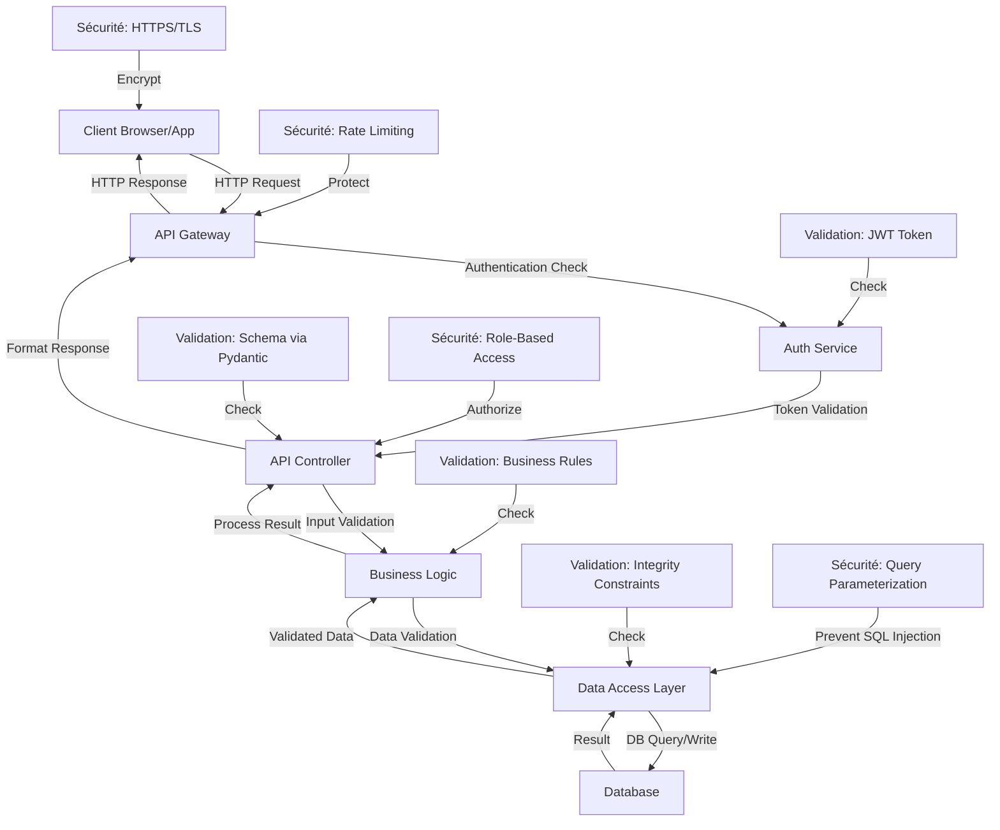

# 2. Fiabilité des Données

Ce document présente les méthodes mises en œuvre pour garantir la fiabilité des données tout au long du flux d'utilisation de notre API BuyYourKawa pour l'ensemble des 10 routes implémentées :

**Routes couvertes** :
1. `POST /token` - Authentification JWT
2. `POST /clients` - Création client
3. `GET /clients` - Liste clients (avec pagination)
4. `GET /clients/{id}` - Détails client
5. `PUT /clients/{id}` - Modification client
6. `GET /products` - Liste produits (avec filtres)
7. `POST /products` - Création produit
8. `POST /orders` - Création commande
9. `GET /orders` - Liste commandes (avec filtres)
10. `GET /analytics` - Analytics de vente

## 2.1 Diagramme de Flux des Données



## 2.2 Méthodes de Validation

| Couche | Méthode de Validation | Description | Implémentation |
|--------|------------------------|-------------|----------------|
| **Transport** | HTTPS/TLS | Chiffrement des communications | Configuration du serveur web |
| **API Gateway** | Rate Limiting | Limitation du nombre de requêtes | Middleware de limitation (429 Too Many Requests) |
| **Authentification** | JWT Validation | Vérification des tokens d'accès | `oauth2_scheme` dans l'API |
| **Contrôleurs** | Schema Validation | Validation des structures de données | Modèles Pydantic dans `models.py` |
| **Service** | Business Rules | Règles métier (ex: unicité email) | Vérifications avant opérations DB |
| **Data Access** | Parameterized Queries | Protection contre les injections SQL | ORM ou requêtes paramétrées |
| **Database** | Constraints | Contraintes d'intégrité | Clés primaires, index, foreign keys |

## 2.3 Code Source des Validations

### Validation des Modèles (Pydantic)

#### 2.3.1 Validation Client

```python
# Extrait de models.py
from pydantic import BaseModel, EmailStr, Field, validator
from typing import Optional
import re

class Address(BaseModel):
    street: str = Field(..., min_length=1, max_length=200)
    city: str = Field(..., min_length=1, max_length=100)
    zip: str = Field(..., min_length=1, max_length=20)
    country: str = Field(..., min_length=1, max_length=100)

class Client(BaseModel):
    name: str = Field(..., min_length=2, max_length=100)
    email: EmailStr
    phone: str
    address: Address
    loyalty_points: int = Field(default=0, ge=0)
    is_active: bool = Field(default=True)
    
    @validator('phone')
    def phone_format(cls, v):
        pattern = r'^\+?[1-9]\d{1,14}$'
        if not re.match(pattern, v):
            raise ValueError('Invalid phone number format. Use E.164 format')
        return v
```

#### 2.3.2 Validation Produit

```python
from enum import Enum
from decimal import Decimal

class ProductCategory(str, Enum):
    coffee = "coffee"
    tea = "tea"
    pastry = "pastry"
    sandwich = "sandwich"
    beverage = "beverage"
    accessory = "accessory"

class Product(BaseModel):
    name: str = Field(..., min_length=1, max_length=200)
    description: Optional[str] = Field(None, max_length=1000)
    price: Decimal = Field(..., gt=0, max_digits=10, decimal_places=2)
    category: ProductCategory
    stock_quantity: int = Field(..., ge=0)
    is_available: bool = Field(default=True)
    
    @validator('price')
    def validate_price(cls, v):
        if v <= 0:
            raise ValueError('Price must be positive')
        return round(v, 2)
```

#### 2.3.3 Validation Commande

```python
from typing import List

class OrderStatus(str, Enum):
    pending = "pending"
    confirmed = "confirmed"
    preparing = "preparing"
    ready = "ready"
    delivered = "delivered"
    cancelled = "cancelled"

class OrderItem(BaseModel):
    product_id: str
    product_name: str = Field(..., min_length=1, max_length=200)
    quantity: int = Field(..., gt=0)
    unit_price: Decimal = Field(..., gt=0, max_digits=10, decimal_places=2)
    total_price: Decimal = Field(..., gt=0, max_digits=10, decimal_places=2)
    
    @validator('total_price')
    def validate_total_price(cls, v, values):
        if 'quantity' in values and 'unit_price' in values:
            expected_total = values['quantity'] * values['unit_price']
            if abs(v - expected_total) > 0.01:
                raise ValueError('Total price must equal quantity * unit_price')
        return v

class Order(BaseModel):
    client_id: str
    client_name: str = Field(..., min_length=1, max_length=100)
    items: List[OrderItem] = Field(..., min_items=1)
    total_amount: Decimal = Field(..., gt=0, max_digits=10, decimal_places=2)
    status: OrderStatus = Field(default=OrderStatus.pending)
    notes: Optional[str] = Field(None, max_length=500)
    
    @validator('total_amount')
    def validate_total_amount(cls, v, values):
        if 'items' in values:
            expected_total = sum(item.total_price for item in values['items'])
            if abs(v - expected_total) > 0.01:
                raise ValueError('Total amount must equal sum of item totals')
        return v
```

### Validation d'Authentification

```python
# Extrait pour la validation des tokens
from fastapi import Depends, HTTPException, status
from fastapi.security import OAuth2PasswordBearer

oauth2_scheme = OAuth2PasswordBearer(tokenUrl="token")

async def get_current_user(token: str = Depends(oauth2_scheme)):
    credentials_exception = HTTPException(
        status_code=status.HTTP_401_UNAUTHORIZED,
        detail="Could not validate credentials",
        headers={"WWW-Authenticate": "Bearer"},
    )
    
    try:
        payload = jwt.decode(token, SECRET_KEY, algorithms=[ALGORITHM])
        username: str = payload.get("sub")
        if username is None:
            raise credentials_exception
    except JWTError:
        raise credentials_exception
        
    user = get_user(username=username)
    if user is None:
        raise credentials_exception
    return user
```

### Tests Automatisés

#### 2.3.4 Tests de Validation par Route

```python
# Extrait de test_main.py
import pytest
from fastapi.testclient import TestClient
from main import app

client = TestClient(app)

# Tests Authentification
def test_token_authentication():
    response = client.post("/token", data={"username": "admin", "password": "password"})
    assert response.status_code == 200
    assert "access_token" in response.json()
    assert response.json()["token_type"] == "bearer"

# Tests Clients
def test_create_client():
    client_data = {
        "name": "Test Client",
        "email": "test@example.com",
        "phone": "+33123456789",
        "address": {
            "street": "123 Test Street",
            "city": "Test City",
            "zip": "12345",
            "country": "France"
        }
    }
    
    response = client.post(
        "/clients",
        json=client_data,
        headers={"Authorization": f"Bearer {token}"}
    )
    
    assert response.status_code == 200
    data = response.json()
    assert "id" in data
    assert data["name"] == client_data["name"]
    assert data["email"] == client_data["email"]

# Tests Produits
def test_create_product():
    product_data = {
        "name": "Espresso Test",
        "description": "Café test",
        "price": 2.50,
        "category": "coffee",
        "stock_quantity": 100
    }
    
    response = client.post(
        "/products",
        json=product_data,
        headers={"Authorization": f"Bearer {token}"}
    )
    
    assert response.status_code == 200
    data = response.json()
    assert data["name"] == product_data["name"]
    assert data["price"] == product_data["price"]
    assert data["category"] == product_data["category"]

# Tests Commandes
def test_create_order():
    order_data = {
        "client_id": "test-client-id",
        "client_name": "Test Client",
        "items": [
            {
                "product_id": "test-product-id",
                "product_name": "Espresso Test",
                "quantity": 2,
                "unit_price": 2.50,
                "total_price": 5.00
            }
        ],
        "total_amount": 5.00,
        "status": "pending"
    }
    
    response = client.post(
        "/orders",
        json=order_data,
        headers={"Authorization": f"Bearer {token}"}
    )
    
    assert response.status_code == 200
    data = response.json()
    assert data["client_name"] == order_data["client_name"]
    assert data["total_amount"] == order_data["total_amount"]
    assert len(data["items"]) == 1

# Tests Analytics
def test_get_analytics():
    response = client.get(
        "/analytics?period=week",
        headers={"Authorization": f"Bearer {token}"}
    )
    
    assert response.status_code == 200
    data = response.json()
    assert "total_sales" in data
    assert "total_orders" in data
    assert "total_clients" in data
    assert "avg_order_value" in data
    assert "top_products" in data

# Tests de Validation d'Erreurs
def test_invalid_email_format():
    invalid_client = {
        "name": "Test",
        "email": "invalid-email",  # Email invalide
        "phone": "+33123456789",
        "address": {"street": "123 Test", "city": "Paris", "zip": "75001", "country": "France"}
    }
    
    response = client.post(
        "/clients",
        json=invalid_client,
        headers={"Authorization": f"Bearer {token}"}
    )
    
    assert response.status_code == 422  # Validation Error

def test_negative_price_product():
    invalid_product = {
        "name": "Test Product",
        "price": -5.00,  # Prix négatif
        "category": "coffee",
        "stock_quantity": 10
    }
    
    response = client.post(
        "/products",
        json=invalid_product,
        headers={"Authorization": f"Bearer {token}"}
    )
    
    assert response.status_code == 422  # Validation Error
```

## 2.4 Validations Métier Spécifiques

### Règles Métier par Route

| Route | Règles Métier | Validation Implémentée |
|-------|-----------------|------------------------|
| `POST /clients` | Email unique, téléphone format E.164 | Vérification unicité + regex |
| `PUT /clients/{id}` | Modification email = nouvelle vérification unicité | Validation conditionnelle |
| `POST /products` | Prix positif, catégorie valide, stock >= 0 | Contraintes Pydantic + enum |
| `POST /orders` | Client existant, produits disponibles, calcul total | Vérifications croisées |
| `GET /orders` | Filtrage par statut, pagination | Validation paramètres query |
| `GET /analytics` | Période valide (today/week/month/year) | Enum validation |

### Gestion des Stocks

```python
# Validation automatique des stocks lors de commande
def validate_stock_availability(order_items: List[OrderItem]):
    for item in order_items:
        product = get_product_by_id(item.product_id)
        if not product:
            raise HTTPException(404, f"Product {item.product_id} not found")
        if not product.is_available:
            raise HTTPException(400, f"Product {product.name} is not available")
        if product.stock_quantity < item.quantity:
            raise HTTPException(400, f"Insufficient stock for {product.name}")
```

### Cohérence des Calculs

```python
# Validation des totaux de commande
def validate_order_totals(order: Order):
    calculated_total = sum(item.total_price for item in order.items)
    if abs(order.total_amount - calculated_total) > 0.01:
        raise HTTPException(400, "Order total does not match item totals")
    
    for item in order.items:
        expected_item_total = item.quantity * item.unit_price
        if abs(item.total_price - expected_item_total) > 0.01:
            raise HTTPException(400, f"Item total incorrect for {item.product_name}")
```

## 2.5 Sécurité du Stockage et des Flux

### Sécurisation des Données Sensibles

| Type de Donnée | Méthode de Protection | 
|----------------|------------------------|
| Mots de passe  | Hachage avec bcrypt + salt |
| Tokens d'accès | Courte durée de vie (30min) + refresh tokens |
| Données personnelles | Chiffrement en base de données |
| Communications | TLS 1.3 de bout en bout |

### Logs et Audit

- Journalisation des accès et modifications
- Horodatage automatique (created_at, updated_at)
- Traces d'audit pour modifications sensibles

## 2.6 Intégrité Front/Back

### Validation Double Couche par Type de Donnée

| Point de Vérification | Front-End | Back-End | Routes Concernées |
|------------------------|-----------|----------|-------------------|
| Validation des formulaires | JavaScript (client-side) | Pydantic (server-side) | Toutes |
| Format email | Regex pattern | EmailStr validator | `/clients` |
| Format téléphone | Input mask | Validator personnalisé | `/clients` |
| Prix et montants | Number input + validation | Decimal avec contraintes | `/products`, `/orders` |
| Catégories produits | Select avec options | Enum validation | `/products` |
| Statuts commandes | Select avec options | Enum validation | `/orders` |
| Quantités | Number input min=1 | Field(gt=0) | `/orders` |
| Périodes analytics | Select avec options | Enum validation | `/analytics` |
| Structure JSON | Typage TypeScript | Schéma Pydantic | Toutes |
| États d'erreur | Affichage contextuel | Codes HTTP + messages JSON | Toutes |

### Codes de Réponse HTTP par Route

| Route | Succès | Erreur Client | Erreur Serveur | Spécifique |
|-------|---------|---------------|----------------|-------------|
| `POST /token` | 200 | 401 (Invalid credentials) | 500 | - |
| `POST /clients` | 201 | 422 (Validation), 409 (Email exists) | 500 | - |
| `GET /clients` | 200 | 401 (Unauthorized) | 500 | - |
| `GET /clients/{id}` | 200 | 404 (Not found) | 500 | - |
| `PUT /clients/{id}` | 200 | 404 (Not found), 422 (Validation) | 500 | - |
| `GET /products` | 200 | 401 (Unauthorized) | 500 | - |
| `POST /products` | 201 | 422 (Validation) | 500 | - |
| `POST /orders` | 201 | 400 (Stock), 422 (Validation) | 500 | - |
| `GET /orders` | 200 | 401 (Unauthorized) | 500 | - |
| `GET /analytics` | 200 | 400 (Invalid period) | 500 | - |

Cette double validation garantit que les données restent cohérentes même en cas de bypass de la validation côté client, et que chaque route retourne des codes d'erreur appropriés selon le contexte métier.
